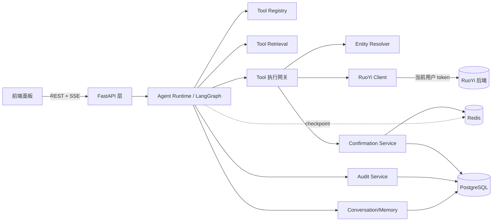

# RuoYi 智能操作助手 — Agent 后端技术文档

> 配套主方案见仓库根目录 `README.md`（v4.0）。本文聚焦 **Agent 服务（后端）实现层**，用于梳理后端开发任务。  
> 本文中的「后端」指 **Agent 服务**（Python / FastAPI / LangGraph），不包含 RuoYi 的 Java 后端。Agent 通过 REST 调用 RuoYi，RuoYi 仍是最终鉴权与事实源。  
> 技术栈：Python 3.11+ · FastAPI · LangGraph · LangChain · Redis · PostgreSQL · httpx · Pydantic v2。

## 目录

1. [范围与目标](#1-范围与目标)
2. [技术栈与依赖](#2-技术栈与依赖)
3. [整体架构](#3-整体架构)
4. [工程目录结构](#4-工程目录结构)
5. [运行期上下文与 Token 注入](#5-运行期上下文与-token-注入)
6. [Agent Runtime（LangGraph）](#6-agent-runtimelanggraph)
7. [核心模块组件](#7-核心模块组件)
   - [7.1 Tool Registry & Manifest](#71-tool-registry--manifest)
   - [7.2 Tool Retrieval](#72-tool-retrieval)
   - [7.3 工具执行网关](#73-工具执行网关)
   - [7.4 Entity Resolver](#74-entity-resolver)
   - [7.5 Confirmation Service](#75-confirmation-service)
   - [7.6 RuoYi Client](#76-ruoyi-client)
   - [7.7 Conversation / Memory](#77-conversation--memory)
   - [7.8 Audit Service](#78-audit-service)
8. [API 与 SSE](#8-api-与-sse)
9. [持久化与数据表](#9-持久化与数据表)
10. [安全模型](#10-安全模型)
11. [并发、幂等与一致性](#11-并发幂等与一致性)
12. [可观测性](#12-可观测性)
13. [评估与测试](#13-评估与测试)
14. [配置项](#14-配置项)
15. [开发任务拆解清单](#15-开发任务拆解清单)

---

## 1. 范围与目标

Agent 服务负责：

- 接收前端消息，编排 LLM 推理与多步工具调用（ReAct）
- 从用户可见工具中检索候选工具
- 解析自然语言中的实体（用户/部门/角色/字典/时间/选中项）到系统 ID
- 写操作生成确认任务，确认后重校验并幂等执行
- 通过 SSE 推送结构化事件
- 记录 Agent 侧审计与链路追踪

Agent **不负责**：最终鉴权、业务规则裁决、直连数据库、Token 签发。

## 2. 技术栈与依赖

| 类别 | 选型 | 说明 |
|------|------|------|
| Web 框架 | FastAPI | SSE（`StreamingResponse`/`sse-starlette`）、依赖注入 |
| 编排 | LangGraph | 状态图、interrupt、checkpoint |
| LLM 接入 | LangChain | tool-calling、模型抽象 |
| 校验 | Pydantic v2 | State、Manifest、入参 schema |
| HTTP 客户端 | httpx（async） | 调用 RuoYi REST，连接池、超时 |
| 缓存/锁/checkpoint | Redis | `langgraph.checkpoint` Redis 实现、分布式锁、确认任务、检索缓存 |
| 持久化 | PostgreSQL（asyncpg / SQLAlchemy async） | 会话、确认、审计 |
| 配置 | pydantic-settings | 环境变量 |
| 可观测 | structlog + OpenTelemetry（可选） | 脱敏日志、trace |
| 评估 | pytest + 自研 eval runner | 固定评估集 |

## 3. 整体架构



分层原则：

- **API 层**：协议适配（REST/SSE）、token 提取、请求级上下文构造，不含业务逻辑。
- **Runtime 层**：LangGraph 图与节点，负责编排。
- **服务层**：Tool/Resolver/Confirmation/RuoYiClient/Audit，各自单一职责。
- **基础设施层**：Redis、PostgreSQL、RuoYi REST。

## 4. 工程目录结构

```text
agent-service/
├─ app/
│  ├─ main.py                      # FastAPI 入口、生命周期、路由注册
│  ├─ api/
│  │  ├─ sessions.py               # /ai/sessions* 路由
│  │  ├─ sse.py                    # SSE 流封装
│  │  └─ deps.py                   # 依赖注入：取 token、构造 RuntimeContext
│  ├─ runtime/
│  │  ├─ graph.py                  # LangGraph 组装（节点 + 边 + interrupt）
│  │  ├─ state.py                  # ConversationState（TypedDict）
│  │  ├─ context.py                # RuntimeContext + contextvar 注入
│  │  └─ nodes/                    # 每个节点一个文件
│  │     ├─ load_state.py
│  │     ├─ refresh_context.py
│  │     ├─ retrieve_tools.py
│  │     ├─ agent_reason.py
│  │     ├─ validate_params.py
│  │     ├─ resolve_entities.py
│  │     ├─ ask_clarification.py
│  │     ├─ prepare_confirm.py
│  │     ├─ execute_tool.py
│  │     ├─ observe_result.py
│  │     ├─ format_output.py
│  │     └─ persist_audit.py
│  ├─ tools/
│  │  ├─ registry.py               # Manifest 加载、启停、权限标签
│  │  ├─ manifest.py               # Manifest Pydantic 模型 + 校验
│  │  ├─ retrieval.py              # Tool Retrieval（关键词/embedding）
│  │  ├─ gateway.py                # 执行网关（9 步）
│  │  ├─ adapters/                 # 复杂工具 Tool Adapter
│  │  └─ manifests/                # YAML Manifest 文件
│  ├─ resolver/
│  │  ├─ base.py                   # Resolver 协议、ResolveResult
│  │  ├─ user.py / dept.py / role.py / dict.py / time_range.py
│  │  └─ registry.py               # 实体类型 → resolver
│  ├─ confirm/
│  │  ├─ service.py                # 生成确认任务、hash、幂等键、重校验
│  │  └─ reconcile.py              # running 超时对账任务
│  ├─ clients/
│  │  └─ ruoyi.py                  # httpx 封装、token 透传、错误归一化
│  ├─ persistence/
│  │  ├─ models.py                 # agent_session/confirmation/audit_event
│  │  ├─ repo.py                   # 仓储
│  │  └─ checkpoint.py             # LangGraph Redis checkpointer 封装
│  ├─ audit/
│  │  └─ service.py                # 审计事件、脱敏
│  ├─ security/
│  │  ├─ redaction.py              # 日志/审计脱敏
│  │  └─ ratelimit.py              # 限流与成本熔断
│  ├─ schemas/
│  │  └─ events.py                 # SSE 事件、错误码、对外 DTO
│  └─ config.py                    # 配置
├─ eval/
│  ├─ suites/                      # 评估集（YAML/JSON）
│  └─ runner.py                    # eval 执行与断言
├─ tests/
├─ pyproject.toml
└─ README.md
```

## 5. 运行期上下文与 Token 注入

**最关键的安全设计**：token 与实时权限**不进任何 LangGraph State**，避免被 checkpointer 序列化落库。改为请求级注入。

```python
# runtime/context.py
import contextvars
from dataclasses import dataclass

@dataclass
class RuntimeContext:
    session_id: str
    user_id: int
    request_token: str            # memory only, per-request, never persisted / never in State
    user_permissions: list[str]
    user_roles: list[str]
    page_context: dict

_ctx: contextvars.ContextVar[RuntimeContext] = contextvars.ContextVar("agent_runtime_ctx")

def set_runtime(ctx: RuntimeContext): _ctx.set(ctx)
def get_runtime() -> RuntimeContext: return _ctx.get()
```

```python
# api/deps.py
async def build_runtime(request: Request, session_id: str) -> RuntimeContext:
    token = extract_bearer(request)                  # 从 Authorization 头
    if not token: raise AuthExpired()
    perms, roles, user_id = await ruoyi.fetch_permissions(token)  # 实时权限
    page_ctx = await get_page_context(request)
    return RuntimeContext(session_id, user_id, token, perms, roles, page_ctx)
```

- 每个请求（`/messages`、`/confirm`、SSE）都重新构造 `RuntimeContext` 并 `set_runtime`。
- 节点内通过 `get_runtime()` 读取 token / 实时权限，不从 `state` 读。
- `ConversationState` 只存 `permission_snapshot_hash`（见 §6.2、§10）。

## 6. Agent Runtime（LangGraph）

### 6.1 图与节点

```python
# runtime/graph.py（示意）
builder = StateGraph(ConversationState)
for name, fn in NODES.items(): builder.add_node(name, fn)
builder.set_entry_point("load_state")
builder.add_edge("load_state", "refresh_context")
builder.add_edge("refresh_context", "retrieve_tools")
builder.add_edge("retrieve_tools", "agent_reason")
builder.add_conditional_edges("agent_reason", route_after_reason, {
    "direct_answer": "format_output",
    "clarify": "ask_clarification",
    "confirm": "prepare_confirm",
    "call_tool": "validate_params",
})
builder.add_edge("validate_params", "resolve_entities")
builder.add_conditional_edges("resolve_entities", route_after_resolve, {
    "clarify": "ask_clarification",     # ambiguous/not_found/forbidden
    "confirm": "prepare_confirm",       # 写操作
    "execute": "execute_tool",          # 只读
})
builder.add_edge("execute_tool", "observe_result")
builder.add_conditional_edges("observe_result", route_after_observe, {
    "continue": "retrieve_tools",       # 多步：二次检索
    "finish": "format_output",
})
builder.add_edge("format_output", "persist_audit")
builder.add_edge("persist_audit", END)
graph = builder.compile(checkpointer=redis_checkpointer, interrupt_before=["execute_tool_after_confirm"])
```

| 节点 | 职责 | 关键点 |
|------|------|--------|
| load_state | 加载会话状态 | thread_id=session_id |
| refresh_context | 刷新权限/page_context | 从 RuntimeContext 注入，写 snapshot_hash |
| retrieve_tools | 检索候选工具 | 注入精简签名 |
| agent_reason | LLM 推理与工具选择 | tool-calling，限制在候选内 |
| validate_params | 入参 schema 校验 | Pydantic / jsonschema |
| resolve_entities | 实体解析 | 走当前 token |
| ask_clarification | 生成补参/消歧事件 | clarify SSE |
| prepare_confirm | 生成确认任务 + interrupt | 写 confirm_payload_hash |
| execute_tool | 调 RuoYi | 执行前重校验、幂等键 |
| observe_result | 决定继续/结束 | step_count、超时 |
| format_output | 整理输出 | data/text |
| persist_audit | 落审计 | 脱敏 |

### 6.2 ConversationState

```python
class ConversationState(TypedDict):
    session_id: str
    user_id: int
    phase: Literal["idle", "clarifying", "awaiting_confirm", "executing"]
    messages: list[dict]
    summary: str | None
    permission_snapshot_hash: str         # 仅 hash，不含明文权限
    page_context: dict
    available_tool_names: list[str]
    retrieved_tools: list[dict]
    pending_tool_call: str | None
    tool_params: dict
    missing_fields: list[str]
    disambiguation: dict | None
    confirm_id: str | None
    confirm_payload_hash: str | None
    confirm_payload: dict | None
    last_tool_result: dict | None
    step_count: int
    correlation_id: str
```

> **严禁** 在 State 放 `request_token`、明文权限列表、明文敏感字段。

### 6.3 interrupt 与 resume

写操作在 `prepare_confirm` 后 interrupt。`/confirm` 触发 resume：用 `confirm_id` 定位任务 → 校验 `payload_hash` → 从当前请求**重新注入 token 与实时权限** → 执行前重校验（§7.5）→ `execute_tool`。checkpoint 中不含 token，resume 必须靠新请求注入。

### 6.4 步数与超时

单轮最大步数 8；单工具超时 10s（查询可配 20s）；整轮 60s。超限返回已完成信息并提示缩小范围。

## 7. 核心模块组件

### 7.1 Tool Registry & Manifest

- Manifest 用 Pydantic 模型校验；YAML 文件位于 `tools/manifests/`，启动时加载到 Registry。
- 字段：`name/title/description/category/source/enabled/http/required_permissions/risk_level/confirm_required/idempotent/retry_on_timeout/entity_fields/input_schema/output_schema/confirm_template/audit/examples`。
- OpenAPI 生成的 Manifest 默认 `enabled: false`，人工审核后启用。
- 校验规则（同主方案 §9.3）：写接口必须有 risk_level/confirm_required；medium/high 必须有 confirm_template；high 必须二次确认；name 全局唯一；权限非空；entity_fields 类型必须已注册 resolver；`idempotent: false` 必须显式 `retry_on_timeout`（默认 false）；examples ≥2。

### 7.2 Tool Retrieval

- MVP：权限过滤后按关键词/拼音/菜单名/路由/别名轻量排序；≤20 个全放上下文。
- 增长后：embedding 向量检索 + Top-K + 工具包联动 + 多步二次检索。
- **注入精简签名**（name/title/description/必填参数/1-2 examples），完整 schema 仅在 validate 阶段用。
- 接口 `retrieve(query, available_tools) -> list[ToolSignature]` 输入输出稳定，升级不改主链路。

### 7.3 工具执行网关

`gateway.py` 统一 9 步：

1. enabled 检查
2. `required_permissions` 检查（实时权限）
3. input_schema 严格校验
4. Entity Resolver（当前 token）
5. 写操作 → 生成确认任务；只读 → 直接调用
6. 确认后校验 confirm hash、实时权限、实体存在性与可见性、幂等键
7. 调 RuoYi
8. 归一化响应
9. 写审计

**写操作硬时序**：`validate_params -> resolve_entities -> prepare_confirm -> execute_tool`；confirm_template 占位符来自已解析实体 `display`；任一写入字段 `ambiguous/not_found/forbidden` 不进 prepare_confirm；execute 前重校验快照，禁用前端回传展示文案作为执行参数。

### 7.4 Entity Resolver

```python
# resolver/base.py
class ResolveResult(BaseModel):
    status: Literal["resolved", "ambiguous", "not_found", "forbidden"]
    field: str
    value: int | str | None = None
    display: str | None = None
    confidence: float = 0.0
    candidates: list[dict] = []
    source: str | None = None

class Resolver(Protocol):
    entity_type: str
    async def resolve(self, ctx: RuntimeContext, raw: str, hint: dict) -> ResolveResult: ...
```

- 实体类型：user / dept / role / dict / time_range / page_selection。
- **数据范围约束**：所有 list 查询走 `ctx.request_token`，结果天然受数据范围约束。
- **防探测**：`not_found` 与 `forbidden` 对外提示一致；`forbidden` 仅内部审计区分。
- 多候选 → `ambiguous`，由 `ask_clarification` 出 clarify 事件（≤5 选项），不允许自动猜测执行写操作。
- 时间解析用 `Asia/Shanghai`，转 RuoYi 约定格式。

### 7.5 Confirmation Service

- 生成确认任务：`confirm_id`（`conf_` 前缀）、`payload_hash`（sha256 参数快照）、`idempotency_key`、`expires_at`（TTL 5min）。
- 存 Redis（带 TTL）+ PostgreSQL（`agent_confirmation`），payload 脱敏、不含 token。
- **执行前重校验**（任一不过即拒绝）：confirm 存在且未过期；payload_hash 匹配；token 有效；实时权限具备；实体存在性与可见性复查；high 已二次确认。
- 状态机：`pending/running/succeeded/failed_retryable/failed_final/canceled/expired`。

### 7.6 RuoYi Client

```python
# clients/ruoyi.py
class RuoYiClient:
    async def request(self, ctx, method, path, *, params=None, json=None, idem_key=None):
        headers = {"Authorization": f"Bearer {ctx.request_token}",
                   "X-Agent-Source": "ai-assistant",
                   "X-Correlation-Id": ctx_correlation_id()}
        if idem_key: headers["X-Idempotency-Key"] = idem_key
        # httpx async 调用 + 超时 + 错误归一化（RUOYI_API_ERROR / PERMISSION_DENIED / AUTH_EXPIRED）
```

- token 逐请求透传；透传 `X-Agent-Source`、`X-Correlation-Id`、`X-Idempotency-Key`。
- 错误归一化为统一错误码（§8）；不向上抛原始堆栈/内网信息。
- 超时与重试策略受 Manifest `idempotent`/`retry_on_timeout` 控制（§11）。

### 7.7 Conversation / Memory

- 最近 N=10 轮原文，长会话压缩 summary。
- summary 不含 token/密码/密钥/敏感字段，只保留业务目标、有效实体显示名与 ID、进行中补参状态、最近失败原因。
- checkpoint 用 Redis（thread_id=session_id）；会话元数据落 `agent_session`。

### 7.8 Audit Service

- 事件：`session_created/tool_retrieved/tool_called/clarification_requested/confirmation_created/action_executed/action_failed/permission_drift_detected/confirmation_reconciled`。
- 全部脱敏后落 `agent_audit_event`，带 `correlation_id`。

## 8. API 与 SSE

### 8.1 REST 接口

| 方法 | 路径 | 说明 |
|------|------|------|
| POST | `/ai/sessions` | 创建会话 |
| GET | `/ai/sessions/{id}/stream` | SSE 事件流 |
| POST | `/ai/sessions/{id}/messages` | 发送用户消息 |
| POST | `/ai/sessions/{id}/confirm` | 确认/拒绝（需重携 token） |
| POST | `/ai/sessions/{id}/cancel` | 取消补参/确认 |
| GET | `/ai/sessions/{id}/history` | 状态恢复，不触发推理 |

> `session_id` 即 LangGraph `thread_id`。`/confirm` resume 后结果从当前 SSE 推送；断开后前端重连新建 SSE 并经 `/history` 恢复。

### 8.2 SSE 事件

基础字段 `seq/event_id/session_id/correlation_id/type/created_at/payload`；类型：`text/text_done/route/data/clarify/confirm/action_result/tool_status/error`。事件结构见主方案 §15。

### 8.3 错误码

`AUTH_EXPIRED / PERMISSION_DENIED / TOOL_NOT_FOUND / VALIDATION_ERROR / ENTITY_AMBIGUOUS / ENTITY_NOT_FOUND / CONFIRM_EXPIRED / EXECUTION_TIMEOUT / RUOYI_API_ERROR / MODEL_ERROR`。

## 9. 持久化与数据表

| 表 | 用途 | 关键字段 |
|----|------|----------|
| `agent_session` | 会话元数据 | id, user_id, phase, summary, permission_snapshot_hash, created_at, updated_at |
| `agent_confirmation` | 确认任务 | confirm_id, session_id, user_id, tool_name, risk_level, payload_hash, payload_json(脱敏), idempotency_key, status, running_started_at, expires_at |
| `agent_audit_event` | 审计 | id, session_id, user_id, correlation_id, event_type, tool_name, risk_level, payload_summary, result_code, created_at |

Redis：LangGraph checkpoint、`agent:session:{id}:lock` 锁、确认任务缓存（TTL）、检索缓存。

## 10. 安全模型

- **Token**：不入 State、不落库；contextvar/`config.configurable` 逐请求注入；SSE 内存持有、断连释放；日志/审计禁打印 token。
- **权限三层**：工具可见性过滤（非边界）→ 执行前校验（辅助）→ RuoYi 最终鉴权（边界）。
- **permission_snapshot_hash**：仅审计 + 漂移检测；执行前以**实时权限**裁决，漂移则按实时拒绝并记 `permission_drift_detected`。
- **Prompt 注入**：工具返回值结构化注入、不拼系统提示；系统提示要求忽略数据中指令；不依据结果 URL 外联；参数过 schema 不接受额外字段；page_context 白名单。
- **脱敏**：密码/token/secret 永不展示；手机号/邮箱按 RuoYi 脱敏；高敏字段不接入工具；导出类不开放。
- **风险等级**：none/low/medium/high/forbidden（forbidden 仅审核期分类）。
- **限流与成本**：单用户频率/每日 token 配额/并发会话上限；成本熔断降级为「仅导航 + 提示人工」。

## 11. 并发、幂等与一致性

- 同一 `session_id` 写操作互斥（Redis 锁）。
- 重复确认通过 `idempotency_key` 返回同一结果。
- RuoYi 支持幂等头则透传；不支持时：**非幂等写操作（idempotent=false）超时不自动重试**，标记 `failed_retryable` 提示核对；幂等写操作可安全重试。
- **running 超时对账**（`confirm/reconcile.py`）：定时扫描 `running_started_at` 超时的确认任务，标记 `failed_retryable`，记 `confirmation_reconciled`，处理进程崩溃导致的悬挂。

## 12. 可观测性

- 链路：每轮生成 `correlation_id`，贯穿 SSE 事件、Agent 日志、RuoYi header、RuoYi 操作日志扩展字段。
- 指标：tool_selection_accuracy、entity_resolution_success_rate、clarification_rate、confirmation_accept_rate、action_success_rate、avg_turn_latency、model_error_rate、permission_denied_rate、permission_drift_rate、llm_cost_per_user。
- 日志：structlog + 脱敏中间件，统一字段。

## 13. 评估与测试

- 评估集（`eval/suites/`）：导航、单步查询、补参、消歧、多步、上下文、权限不足、高风险二次确认、token 过期重放、权限漂移、并发、数据范围、批量部分失败、prompt 注入红队、running 对账。
- 断言：选对工具、未调未授权工具、写前必 confirm、正确解析/消歧、预期 SSE 序列、写审计、不泄露敏感字段、not_found/forbidden 提示一致。
- 门槛：导航 ≥95%、只读查询 ≥90%、写确认覆盖率=100%、未授权写=0、幂等重复=0、红队通过=100%、P95 首 token ≤3s。
- 确定性：固定 `temperature=0`、固定模型版本、每用例 N≥3 取通过率、模型/prompt 变更触发全量回归。
- CI：P2 后接 smoke eval；P4 后接写操作 eval。

## 14. 配置项

| 配置 | 说明 |
|------|------|
| `LLM_PROVIDER` / `LLM_MODEL` / `LLM_TEMPERATURE` | 模型（评估固定 temperature=0） |
| `RUOYI_BASE_URL` | RuoYi 后端地址 |
| `REDIS_URL` / `POSTGRES_DSN` | 基础设施 |
| `CONFIRM_TTL_SECONDS` | 确认 TTL，默认 300 |
| `MAX_STEPS` / `TOOL_TIMEOUT` / `TURN_TIMEOUT` | 8 / 10s / 60s |
| `RATE_LIMIT_*` / `DAILY_TOKEN_QUOTA` | 限流与成本 |
| `TOOL_RETRIEVAL_MODE` | keyword / embedding |

## 15. 开发任务拆解清单

对应主方案 P0–P8，可据此建卡：

- [ ] **P0 骨架**：FastAPI + 生命周期、`RuntimeContext`/contextvar、token 提取、统一错误码、structlog 脱敏、SSE 封装、Redis/PG 连接
- [ ] **P0 状态机**：`ConversationState`、LangGraph 组装、Redis checkpointer、`/sessions` 创建
- [ ] **P1 导航**：菜单拉取（当前 token）、navigate 工具、route 事件、导航评估
- [ ] **P2 查询工具**：query_* Manifest、Tool Registry 加载与校验、`retrieve_tools` 占位（精简签名）、data 事件、smoke eval
- [ ] **P3 实体解析**：user/dept/role/dict/time_range resolver（当前 token）、ambiguous/not_found/forbidden（提示一致）、clarify、page_selection
- [ ] **P4 写操作**：create/update/status/delete、Confirmation Service、prepare_confirm + interrupt、强制时序、执行前重校验、幂等键、二次确认、批量部分失败、running 对账、history 恢复、写操作 eval
- [ ] **P5 多步与检索**：ReAct 多步、observe_result 二次检索、embedding + Top-K、工具包、step/超时保护
- [ ] **P6 工具链**：旁路 YAML 规范、`agent-tool scan/validate/eval` CLI、Manifest 校验、评估模板生成
- [ ] **P7 OpenAPI 候选**：SpringDoc 解析、disabled Manifest、风险初判、人工审核
- [ ] **P8 生产化**：指标、链路追踪、重试降级、限流熔断、安全回归（含红队）、压测并发、灰度开关
