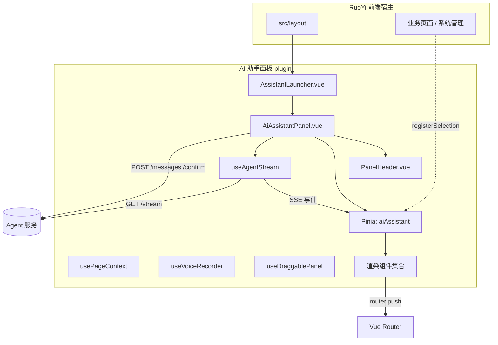

# RuoYi 智能操作助手 — 前端技术文档

> 配套主方案见仓库根目录 `README.md`（v4.0）。本文聚焦**前端实现层**，用于梳理前端开发任务。  
> 技术栈：Vue 3 + `<script setup>` + TypeScript + Element Plus + Pinia + Vue Router + Vite（与 plus-ui 默认前端一致）。

## 目录

1. [范围与目标](#1-范围与目标)
2. [技术栈与依赖](#2-技术栈与依赖)
3. [整体架构与页面形态](#3-整体架构)
4. [目录结构](#4-目录结构)
5. [状态管理（Pinia）](#5-状态管理pinia)
6. [SSE 传输层](#6-sse-传输层)
7. [事件分发与协议类型](#7-事件分发与协议类型)
8. [组件清单与职责](#8-组件清单与职责)
9. [page_context 采集](#9-page_context-采集)
10. [断线与刷新恢复](#10-断线与刷新恢复)
11. [错误处理与降级](#11-错误处理与降级)
12. [与 RuoYi 框架的集成点](#12-与-ruoyi-框架的集成点)
13. [安全约束（前端侧）](#13-安全约束前端侧)
14. [开发任务拆解清单](#14-开发任务拆解清单)
15. [前端验收场景](#15-前端验收场景)

---

## 1. 范围与目标

前端负责：

- 提供常驻 AI 助手面板（输入、消息流、连接状态）
- 提供右下角悬浮入口按钮，点击后在页面右侧展开助手侧边栏
- 支持侧边栏与可拖拽浮层互相切换，浮层拖拽时不超出页面可视范围
- 支持文字输入与语音输入；语音录制确认后上传 Agent 转写，再进入同一对话链路
- 建立并维护 SSE 连接，消费 Agent 推送的事件
- 把事件渲染为：流式文本、表格、消歧选项、确认卡片、执行结果、进度
- 接收 `route` 事件执行页面跳转
- 采集当前页面 `page_context` 随消息上送
- 断线/刷新后恢复 UI 状态

前端**不负责**：鉴权裁决、业务规则、最终执行（均由 Agent + RuoYi 后端完成）。前端传入的 ID 只作候选，执行前由后端复查。

## 2. 技术栈与依赖

| 类别 | 选型 | 说明 |
|------|------|------|
| 框架 | Vue 3 + `<script setup>` + TS | 与 plus-ui 一致 |
| UI | Element Plus | `el-table`、`el-card`、`el-button`、`el-link`、`el-checkbox`、`el-input` 等 |
| 状态 | Pinia | 会话状态、消息列表、当前确认 |
| 路由 | Vue Router | route 事件跳转、page_context 读取 |
| 构建 | Vite | RuoYi 默认 |
| SSE 传输 | `@microsoft/fetch-event-source` | **必须**：原生 EventSource 不支持自定义请求头 |
| Markdown | `markdown-it` + 代码高亮（可选） | 流式文本渲染 |
| 语音录制 | `MediaRecorder` + Web Audio API | 浏览器端录音、音量波形、取消/确认 |
| HTTP | RuoYi 既有 axios 封装（`@/utils/request`） | 复用拦截器与 token 注入 |
| 鉴权工具 | RuoYi 既有 `@/utils/auth` | 取/刷新 token |

新增依赖仅 `@microsoft/fetch-event-source`（及可选 `markdown-it`）。语音录制优先使用浏览器原生 `MediaRecorder` 与 Web Audio API，不额外引入录音库。

## 3. 整体架构



要点：

- 面板挂在 `src/layout` 层，**跳转业务页时面板不卸载**（持久连接、持久会话）。
- 业务页面通过轻量「选区注册」把选中行上报给 store，面板无需侵入每个业务页。
- 数据流单向：SSE 事件 → store → 组件渲染；用户动作 → POST → 结果仍从 SSE 回推。

### 3.1 页面形态与布局规则

- 默认只显示右下角悬浮入口按钮；点击后打开覆盖在原有页面右侧的助手侧边栏。
- 侧边栏主体是对话页面：上方为标题与操作区，中间为消息流，底部为输入区。
- 右上角固定两个图标按钮：最右是关闭按钮；紧挨关闭按钮左侧是侧边栏/浮层切换按钮。
- 关闭按钮收起面板并回到悬浮入口按钮，不销毁当前会话；退出登录或切换用户时才清理会话状态。
- 侧边栏覆盖页面右侧，不改变原 RuoYi 页面布局；宽度建议 `420px`，移动端可占满宽度。

### 3.2 浮层切换与拖拽

- 从右侧栏切换为浮层时，面板整体向左平移一段距离，给用户“已脱离侧边栏，可拖动”的视觉提示。
- 浮层高度比完整侧边栏减少 `100px`，默认可用 `top: 50px; height: calc(100vh - 100px)`；宽度沿用侧边栏宽度。
- 浮层顶部标题栏作为拖拽手柄；只有拖住顶部区域才触发全局拖拽，消息区和输入区不触发拖拽。
- 拖拽位置必须被夹紧在可视范围内，四周保留 `8px` 安全边距；窗口 resize、缩放或移动端 visual viewport 变化后重新夹紧。
- 切回侧边栏时清除浮层定位样式，回到右侧贴边布局；再次切为浮层时优先恢复本会话内上次位置，若越界则重新夹紧。

## 4. 目录结构

```text
src/plugins/ai-assistant/
├─ AssistantLauncher.vue         # 右下角悬浮入口按钮
├─ AiAssistantPanel.vue          # 容器组件
├─ components/
│  ├─ PanelHeader.vue            # 标题栏、关闭、侧边栏/浮层切换、拖拽手柄
│  ├─ MessageList.vue            # 消息流容器，按 message.kind 分发子组件
│  ├─ MessageText.vue            # text / text_done 流式 Markdown
│  ├─ DataTable.vue              # data 事件表格
│  ├─ ClarifyCard.vue            # clarify 消歧/补参选项
│  ├─ ConfirmCard.vue            # confirm 确认卡片（含二次确认）
│  ├─ ActionResult.vue           # action_result 执行结果
│  ├─ ToolStatus.vue             # tool_status 进度
│  ├─ VoiceRecorderBar.vue       # 语音录制条、波形、取消/确认 icon
│  └─ ConnectionBadge.vue        # 连接状态指示
├─ composables/
│  ├─ useAgentStream.ts          # SSE 连接、重连、事件分发入口
│  ├─ usePageContext.ts          # 采集 page_context
│  ├─ useAgentSession.ts         # 创建会话、发送消息、语音上传、确认/取消、history 恢复
│  ├─ useVoiceRecorder.ts        # 麦克风授权、录音、波形采样、Blob 输出
│  └─ useDraggablePanel.ts       # 浮层拖拽、边界夹紧、resize 处理
├─ store/
│  └─ aiAssistant.ts             # Pinia store
├─ api/
│  └─ agent.ts                   # /ai/sessions/* 接口封装（复用 request）
├─ types/
│  └─ events.ts                  # AgentEvent / 各 payload 类型定义
└─ utils/
   ├─ dispatch.ts                # dispatchEvent：type → handler
   └─ errorMap.ts                # 错误码 → 友好文案
```

## 5. 状态管理（Pinia）

```ts
// store/aiAssistant.ts
interface AgentMessage {
  id: string;
  kind: 'text' | 'data' | 'clarify' | 'confirm' | 'action_result' | 'tool_status';
  payload: unknown;
  done?: boolean;          // text 流式是否结束
}

interface AiAssistantState {
  sessionId: string | null;
  phase: 'idle' | 'clarifying' | 'awaiting_confirm' | 'executing';
  panelOpen: boolean;
  panelMode: 'drawer' | 'floating';
  floatingRect: { left: number; top: number; width: number; height: number } | null;
  messages: AgentMessage[];
  lastEventId: string | null;       // 断线续传
  seenEventIds: Set<string>;        // 去重
  pendingConfirm: ConfirmPayload | null;
  pendingClarify: ClarifyPayload | null;
  connection: 'connecting' | 'open' | 'closed' | 'error';
  selection: SelectedRow[];         // 业务页注册的当前选区
  voiceState: 'idle' | 'requesting_permission' | 'recording' | 'ready' | 'uploading' | 'error';
}
```

关键 action：

- `ensureSession()`：无 session 时 `POST /ai/sessions`
- `appendText(eventId, delta)` / `finishText(eventId)`：流式文本
- `pushMessage(msg)`：追加 data / action_result 等
- `setConfirm(payload)` / `clearConfirm()`：确认卡片生命周期
- `openPanel()` / `closePanel()`：悬浮入口与面板开关
- `switchPanelMode(mode)`：侧边栏/浮层切换，切到浮层时初始化或恢复 `floatingRect`
- `setFloatingRect(rect)`：拖拽后写入夹紧后的浮层位置
- `setVoiceState(state)`：录音授权、录制、上传等状态
- `registerSelection(rows, meta)`：业务页上报选区
- `reset()`：退出登录/切换用户时清空（含 `seenEventIds`）

> store 中**不存 token**；token 始终从 `@/utils/auth` 实时取。

## 6. SSE 传输层

**核心约束**：原生 `EventSource` 无法设置 `Authorization` 头，禁止使用。改用 `@microsoft/fetch-event-source`，token 放请求头不放 URL。

```ts
// composables/useAgentStream.ts
import { fetchEventSource } from '@microsoft/fetch-event-source';
import { getToken } from '@/utils/auth';
import { useAiAssistantStore } from '../store/aiAssistant';
import { dispatchEvent } from '../utils/dispatch';

export function useAgentStream() {
  const store = useAiAssistantStore();
  let ctrl: AbortController | null = null;

  function connect(sessionId: string) {
    ctrl?.abort();
    ctrl = new AbortController();
    store.connection = 'connecting';
    fetchEventSource(`/ai/sessions/${sessionId}/stream`, {
      headers: {
        Authorization: `Bearer ${getToken()}`,
        'Last-Event-ID': store.lastEventId ?? '',
      },
      signal: ctrl.signal,
      openWhenHidden: true,
      onopen: async () => { store.connection = 'open'; await store.recoverFromHistory(); },
      onmessage(ev) {
        const event = JSON.parse(ev.data);
        if (store.seenEventIds.has(event.event_id)) return;
        store.seenEventIds.add(event.event_id);
        store.lastEventId = event.event_id;
        dispatchEvent(event, store);
      },
      onerror(err) { store.connection = 'error'; throw err; }, // 抛出→库指数退避重连
    });
  }
  function disconnect() { ctrl?.abort(); store.connection = 'closed'; }
  return { connect, disconnect };
}
```

要点：

- `openWhenHidden: true`：切到业务页签也保持连接。
- 重连后 `onopen` 调用 `recoverFromHistory()` 对齐状态（§10）。
- `Last-Event-ID` + `seenEventIds` 双重去重，避免重复卡片/重复 text。
- 退出登录或切换用户时 `disconnect()` 并 `store.reset()`。

## 7. 事件分发与协议类型

事件基础结构（与主方案 §15.2 一致）：

```ts
// types/events.ts
interface AgentEventBase {
  seq: number; event_id: string; session_id: string;
  correlation_id: string; created_at: string;
}
type AgentEvent = AgentEventBase & (
  | { type: 'text'; payload: { delta: string } }
  | { type: 'text_done'; payload: {} }
  | { type: 'route'; payload: RoutePayload }
  | { type: 'data'; payload: DataPayload }
  | { type: 'clarify'; payload: ClarifyPayload }
  | { type: 'confirm'; payload: ConfirmPayload }
  | { type: 'action_result'; payload: ActionResultPayload }
  | { type: 'tool_status'; payload: { tool: string; state: string } }
  | { type: 'error'; payload: { code: string; message: string; retryable: boolean } }
);
```

分发表：

| type | handler | 作用 |
|------|---------|------|
| text | `appendText` | 追加增量 |
| text_done | `finishText` | 定稿 Markdown |
| route | `handleRoute` | 校验后 `router.push` |
| data | `pushMessage` | 追加表格 |
| clarify | `setClarify` + `pushMessage` | 渲染选项，`phase=clarifying` |
| confirm | `setConfirm` | 渲染确认卡片，`phase=awaiting_confirm` |
| action_result | `pushMessage` + `notifyBizRefresh` | 结果 + 刷新业务页 |
| tool_status | `updateToolStatus` | 进度 |
| error | `mapError` | 友好文案 / Toast / token 刷新 |

## 8. 组件清单与职责

| 组件 | 输入（props） | 职责 | 关键 Element Plus |
|------|---------------|------|-------------------|
| `AssistantLauncher` | `panelOpen` | 右下角悬浮入口按钮 | `el-button` |
| `AiAssistantPanel` | — | 侧边栏/浮层容器、消息区、输入区、连接状态 | `el-drawer`/自定义浮层、`el-input` |
| `PanelHeader` | `panelMode, connection` | 标题栏、关闭、侧边栏/浮层切换、浮层拖拽手柄 | `el-button`、`el-tooltip` |
| `MessageList` | `messages` | 按 `kind` 分发子组件、滚动到底 | `el-scrollbar` |
| `MessageText` | `text, done` | 流式 Markdown 渲染 | — (markdown-it) |
| `DataTable` | `payload: DataPayload` | 动态列表格、truncated 引导、查看全部 | `el-table`、`el-table-column`、`el-link` |
| `ClarifyCard` | `payload: ClarifyPayload` | 最多 5 选项、点选回传 | `el-card`、`el-radio`/`el-button` |
| `ConfirmCard` | `payload: ConfirmPayload` | 影响范围、倒计时、二次确认、确认/拒绝/修改 | `el-card`、`el-button`、`el-checkbox`、`el-input`、`el-countdown` |
| `ActionResult` | `payload: ActionResultPayload` | 成功/失败明细 | `el-result`、`el-alert` |
| `ToolStatus` | `tool, state` | 工具执行进度 | `el-progress`/loading |
| `VoiceRecorderBar` | `voiceState, level` | 录音条、实时波形、取消/确认 icon | `el-button`、自定义波形 |
| `ConnectionBadge` | `connection` | 连接状态点 | `el-tag` |

### 8.1 ConfirmCard 行为细则（重点组件）

- 展示 `title`、`summary`、`affected_resources`、`expires_at` 倒计时。
- `risk_level=medium`：单按钮「确认执行」。
- `risk_level=high`：必须二次确认——勾选「我已知晓影响」或输入关键字（如 `确认删除`）后按钮才可用；批量操作展示数量 + 前若干条资源名称。
- 确认 → `POST /confirm`（**重新携带 token**，由 axios 拦截器注入），带 `confirm_id`；高风险还必须带服务端可验证的 `ack_checked` 或 `second_confirm_text`，不能只依赖前端按钮禁用；拒绝/修改 → `action: reject/modify`。
- 倒计时归零或收到 `CONFIRM_EXPIRED` → 卡片置灰，提示重新发起。
- 结果不在此处理，统一通过 SSE `action_result` 回推。

### 8.2 DataTable 展示规则

- `<=20` 条：表格 + 简短摘要。
- `truncated=true`（`>20`）：展示前 20 条 + `total` + 「在业务页查看全部」（携带相同查询条件 `router.push`）。
- 空结果：提示未找到并给出可修改条件。
- 不在面板做完整分页，大数据量引导回业务页。

### 8.3 输入区与语音录制

- 底部输入区常驻在侧边栏/浮层底部，包含文本输入框、发送按钮、语音按钮。
- 点击语音按钮后调用浏览器麦克风授权；授权中显示请求状态，授权失败提示用户检查浏览器权限并回到文字输入。
- 授权成功后显示 `VoiceRecorderBar`：左侧为录音状态与时长，中间显示实时语音波动，右侧为取消 icon 和确认 icon。
- 取消 icon：停止录音并丢弃本次音频，不发送给 Agent。
- 确认 icon：停止录音，将音频 Blob、`page_context`、`client_message_id`、`duration_ms`、`locale` 通过 `POST /ai/sessions/{sessionId}/voice/messages` 上传。
- Agent 返回 transcript 后，前端把 transcript 作为用户消息展示；后续工具调用、确认卡片、执行结果仍从 SSE 推送。
- 默认录音格式优先 `audio/webm;codecs=opus`，不支持时使用 `MediaRecorder.isTypeSupported()` 选择浏览器可用格式；前端限制录音时长，超时自动停止并提示确认或重录。

### 8.4 浮层拖拽验收规则

- 只有 `panelMode='floating'` 且鼠标按下 `PanelHeader` 拖拽区域时才允许拖动。
- 拖动过程中用 `requestAnimationFrame` 更新位置，释放鼠标后写入 `floatingRect`。
- 位置计算优先使用 `window.visualViewport`，缺失时使用 `window.innerWidth/innerHeight`。
- `left` 必须在 `[8, viewportWidth - width - 8]`，`top` 必须在 `[8, viewportHeight - height - 8]`；面板尺寸大于可视区域时按最小边距降级。
- 监听 `resize` 与 `visualViewport.resize`，窗口变化后立即夹紧当前位置，避免面板被拖到屏幕外。

## 9. page_context 采集

```ts
// composables/usePageContext.ts
export function usePageContext(): PageContext {
  const route = useRoute();
  const store = useAiAssistantStore();
  return {
    route: route.path,
    page_title: route.meta?.title as string,
    query_params: pickWhitelist(route.query),                 // 仅白名单
    route_fingerprint: buildRouteFingerprint(route),           // route + 白名单 query
    selected_rows_summary: store.selection.slice(0, 20),       // 最多 20 条
  };
}
```

选区注册机制（业务页改动最小化）：业务页面在 `el-table` 的 `@selection-change` 时调用一次注册即可：

```ts
// 业务页面（如 system/user/index.vue）
const store = useAiAssistantStore();
function onSelectionChange(rows) {
  store.registerSelection(
    rows.map(r => ({
      resource_type: 'user',
      primary_key: r.userId,
      display: `${r.nickName} / ${r.userName}`,
      route: '/system/user',
      selected_at: new Date().toISOString(),
    })),
    { route: '/system/user', table_id: 'system-user-table' },
  );
}
```

字段约束：仅白名单（`route`、`page_title`、`query_params`、`route_fingerprint`、`selected_rows_summary`）；选中行 ≤20；每行只允许 `resource_type`、`primary_key`、`display`、`route`、`selected_at` 等非敏感摘要字段；不传密码/手机号等敏感字段；**ID 只作候选**。

选区生命周期：

- 路由变化、白名单筛选条件变化、表格刷新、用户清空选择时必须清空旧选区。
- 发送消息前若当前 `route_fingerprint` 与选区注册时不一致，则不携带选区，并提示用户重新选择。
- Agent 执行前仍需用当前 token 复查 `resource_type + primary_key` 的存在性与可见性，不能信任前端选区。

## 10. 断线与刷新恢复

```ts
// store action: recoverFromHistory()
async recoverFromHistory() {
  if (!this.sessionId) return;
  const h = await getHistory(this.sessionId);  // GET /history
  this.phase = h.phase;
  this.rebuildMessages(h.messages);
  if (h.phase === 'awaiting_confirm') this.pendingConfirm = toConfirmPayload(h);
  else if (h.phase === 'executing' && h.execution_id) { /* 继续监听 SSE；已完成则展示 action_result */ }
}
```

规则：

- 面板挂载、SSE 重连成功（`onopen`）、浏览器刷新后都先 `GET /history` 对齐再重建 UI。
- `awaiting_confirm` 一律由 `/history` 重建卡片，**不靠 SSE 重推 confirm**，避免重复卡片/重复确认。
- 恢复信息仅用于 UI；真正执行以服务端确认快照为准。
- 重连后的 `/confirm` 必须重新携带 token。

## 11. 错误处理与降级

```ts
// utils/errorMap.ts
const ERROR_TEXT: Record<string, string> = {
  AUTH_EXPIRED: '登录状态已过期，请刷新后重试。',
  PERMISSION_DENIED: '你没有执行该操作的权限。',
  ENTITY_AMBIGUOUS: '匹配到多个对象，请先选择。',
  CONFIRM_EXPIRED: '确认已超时，请重新发起。',
  VOICE_PERMISSION_DENIED: '浏览器未授权麦克风，请授权后重试。',
  VOICE_TRANSCRIBE_FAILED: '语音识别失败，请重录或改用文字输入。',
  STALE_SELECTION: '当前页面选择已变化，请重新选择后再操作。',
  // ...
};
```

- 按 `code` 映射友好文案，**不展示堆栈、内网地址、SQL**。
- `AUTH_EXPIRED`：触发 RuoYi 既有 token 刷新；刷新成功后若处于 `awaiting_confirm`，凭原 `confirm_id` 直接重放 `/confirm`，无需用户重述。
- `retryable=true`：展示「重试」按钮。
- `MODEL_ERROR`：不影响已确认操作；仅提示文本生成失败。
- `VOICE_*`：不影响当前会话，清理录音状态并回到文字输入。
- `STALE_SELECTION`：清空前端选区状态，引导用户在当前页面重新选择。

## 12. 与 RuoYi 框架的集成点

| 集成点 | 做法 |
|--------|------|
| 布局挂载 | 在 `src/layout` 注入 `AiAssistantPanel`，全局常驻 |
| 路由跳转 | 复用全局 `router`；`router.resolve` 校验权限/存在性后 `router.push` |
| 鉴权 token | 复用 `@/utils/auth` 的 `getToken()` 与刷新逻辑 |
| HTTP 请求 | 复用 `@/utils/request`（axios 拦截器自动注入 Authorization） |
| 国际化 | confirm_template/错误文案走 RuoYi i18n（如需多语言） |
| 权限指令 | 入口按钮可用 `v-hasPermi` 控制面板可见性（可选） |
| 浏览器权限 | 语音录制只在用户点击语音按钮后请求麦克风授权，不做后台监听 |

## 13. 安全约束（前端侧）

- token 不写入 Pinia/localStorage 之外的任何自定义存储，统一走 `@/utils/auth`；SSE 用 header 携带。
- page_context 严格白名单，敏感字段不传。
- 前端 ID 只作候选，不作为执行依据。
- 工具结果中的 URL 不自动请求、不可点击外链（防 SSRF/钓鱼）。
- Markdown 渲染需防 XSS（markdown-it 关闭 raw html 或做 sanitize）。
- 业务数据按服务端脱敏结果展示，前端不反脱敏。
- 录音只在用户主动点击并授权后进行；取消录音立即释放 `MediaStream`，确认上传后也要停止全部 track。
- 原始音频 Blob 不写入 Pinia、localStorage、IndexedDB；仅在内存中保留到取消或确认上传完成。
- 波形只展示音量采样，不持久化原始音频或频谱数据。

## 14. 开发任务拆解清单

可直接据此建卡（建议顺序对应主方案 P0–P5）：

- [ ] **脚手架**：`plugins/ai-assistant` 目录、Pinia store、类型定义、api 封装
- [ ] **入口与面板**：`AssistantLauncher`、`AiAssistantPanel`、右侧栏打开/关闭、`ConnectionBadge`
- [ ] **侧边栏/浮层**：`PanelHeader`、侧边栏/浮层切换、浮层默认左移和减高 100px、拖拽边界夹紧
- [ ] **SSE 传输**：`useAgentStream`（fetch-event-source、重连、去重、openWhenHidden）
- [ ] **会话**：`useAgentSession`（创建会话、发送文字消息、语音上传、cancel）
- [ ] **语音输入**：`useVoiceRecorder` + `VoiceRecorderBar`（授权、录音条、波形、取消/确认、上传 transcript）
- [ ] **文本渲染**：`MessageText` 流式 Markdown + XSS 防护
- [ ] **导航**：`handleRoute` + 权限/存在性校验
- [ ] **表格**：`DataTable` 动态列 + truncated 引导
- [ ] **消歧**：`ClarifyCard` 选项回传
- [ ] **确认**：`ConfirmCard`（medium/high 二次确认 + 倒计时 + 重携 token）
- [ ] **结果**：`ActionResult` + 通知业务页刷新
- [ ] **进度**：`ToolStatus`
- [ ] **上下文**：`usePageContext` + route 指纹 + 业务页选区注册/清理（先接用户管理页）
- [ ] **恢复**：`recoverFromHistory`（挂载/重连/刷新）
- [ ] **错误**：`errorMap` + AUTH_EXPIRED 刷新重放
- [ ] **集成**：layout 挂载、退出登录清理、权限入口控制
- [ ] **联调**：与 Agent 服务对齐事件结构、错误码、history 字段

## 15. 前端验收场景

- 悬浮入口：默认显示右下角按钮，点击打开右侧侧边栏，关闭后恢复入口按钮且会话不丢失。
- 模式切换：右上角切换按钮可在侧边栏与浮层之间切换；浮层默认向左偏移并减高 100px。
- 拖拽边界：拖住浮层顶部可全局拖动；任何方向拖动、窗口 resize 后都不能超出可视范围。
- 文字输入：发送消息时携带最新 `page_context`，结果从 SSE 渲染。
- 语音授权：首次点击语音按钮触发麦克风授权；拒绝授权时不影响文字输入。
- 语音录制：授权成功后显示录音条和波形；取消丢弃，确认上传，上传后展示 transcript。
- 选区安全：路由或筛选条件变化后旧选区被清空；旧选区不能被用于新的上下文操作。
